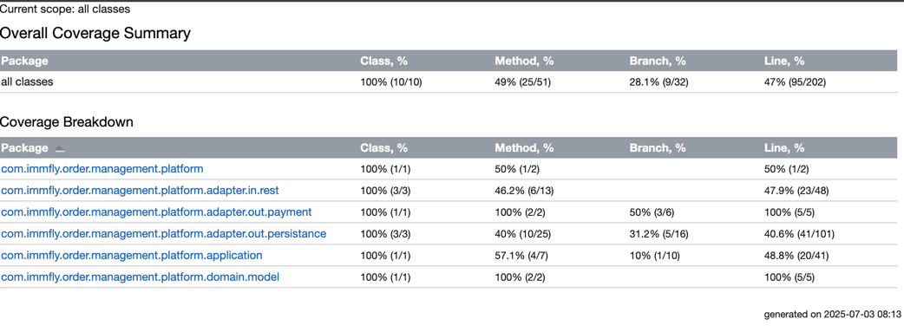

# Immfly Assessment Test

## Architecture Overview
For implementation of in-flight Order Management System (OMP) we will use [Hexagonal Architecture](https://en.wikipedia.org/wiki/Hexagonal_architecture_(software)) with [Spring Boot](https://spring.io/projects/spring-boot).
Also we will use [Testcontainers](https://www.testcontainers.org/) for integration tests and [Gradle](https://gradle.org/) as build tool.
Local development will be done using docker compose for running local database.
See [Environment Setup](#environment-setup) section for instructions on how to set up your local environment.

## Solution Overview
The solution consists of a single module `omp` with base package `com.immfly.order.management.platform`
and the following sub-packages:
 - `adapter` - contains adapters for external systems, such as database and REST API.
 - `application` - contains business logic for managing order operations.
 - `domain` - contains domain model and services for internal business logic.

Tests are implemented to test only Happy Path scenarios, as the focus is on the implementation of the core functionality.



## Environment Setup 
Assuming you have [Homebrew](https://brew.sh) installed, so let's install the rest of necessary tools to build project.

```bash
brew install jq gradle openjdk@21 colima docker docker-compose
```

Start Colima with Docker:
```bash
/opt/homebrew/opt/colima/bin/colima \
                start --network-address  \
                -f
```
Wait for Colima to start, it may take a few minutes.

Configure environment variables for Java and Docker:
```bash
echo 'export PATH="/opt/homebrew/opt/openjdk@21/bin:$PATH"' >> ~/.zprofile
echo 'export JAVA_HOME="$(brew --prefix openjdk@21)"' >> ~/.zprofile
echo 'export DOCKER_HOST=unix://$HOME/.colima/default/docker.sock' >> ~/.zprofile
echo 'export TESTCONTAINERS_DOCKER_SOCKET_OVERRIDE=$HOME/.colima/default/docker.sock' >> ~/.zprofile
echo 'export TESTCONTAINERS_HOST_OVERRIDE=$(colima ls -j | jq -r '.address')' >> ~/.zprofile
echo 'export TESTCONTAINERS_RYUK_DISABLED=true' >> ~/.zprofile
```

Load environment variables:
```bash
. ~/.zprofile
```

## Build and Run
To build the project, run the following command:
```bash
gradle build
```
Start the local database using Docker Compose:
```bash
docker compose up -d
```

To run the application, use the following command:
```bash
gradle omp:bootRun
```